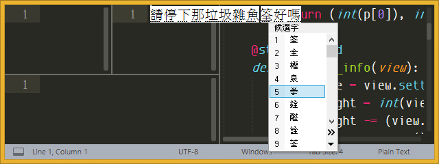
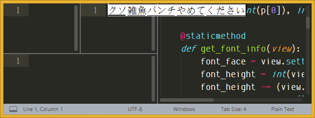
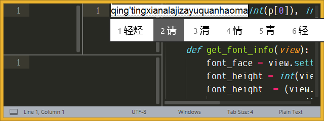
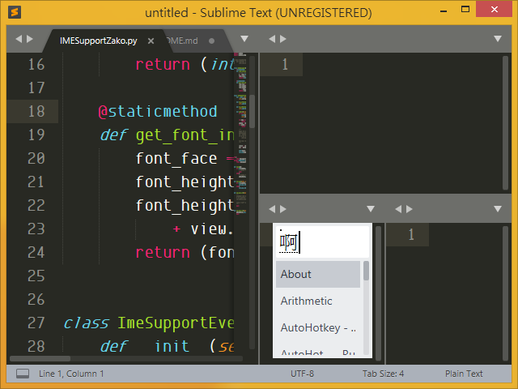

請看：[https://github.com/zcodes/IMESupport](https://github.com/zcodes/IMESupport)

# IMESupportZako

Ever since I started to use [Origami](https://github.com/SublimeText/Origami) I found that [IMESupport](https://github.com/chikatoike/IMESupport) isn't working well with it. The IME composition window isn't displayed at correct position. This is a **personal repo where I try to fix it for myself**.

### Disclaimer

I have no experience in both Python and Sublime Text plugin creation and I find it hard to understand all the original code. Instead of making modification to the original IMESupport plugin or other forks, it's easier for me to create a new plugin, copy-paste and modify only the code I think is needed. That's why many codes and files are gone comparing to the original version. Currently it's not working perfectly but enough for me.

If you have the same problem and happen to have the same environment as me, maybe you can try this. Nothing is promised though.

## Environment

* Sublime Text Version 3.1.1, Build 3176 x64
* Windows 8.1 64-bit
    - Chinese (Traditional) - Microsoft Bopomofo → OK
      
    - Japanese - Microsoft IME → OK
      
    - Chinese (Simplified) - Microsoft Pinyin → basically OK (position may be wrong when started with `i`, `u`, or `v`)
      

<!-- ## Screenshot

 -->

## Known Issue

* cursor 在 [widget (dialog)](http://docs.sublimetext.info/en/latest/reference/settings.html?highlight=is_widget#system-and-miscellaneous-settings) 裡的情況有時候定位不準。
* 切換顯示或隱藏 Side Bar 的時候定位不準 — as mentioned by [zcodes](https://github.com/zcodes/IMESupport)。

以上情況似乎都是讓 selection 更新 (例如隨便打個英文字) 就好了。後者已知問題出在目前程式的 `set_pos` 進入點為 `on_selection_modified`，但 Toggle Side Bar 以後此事件不會被觸發，所以不會重新定位。前者還沒研究，但應該也是類似原因。

* Chinese (Simplified) - Microsoft Pinyin 開頭打 `i`, `u`, or `v` (也就是不成一個中文字的情況) 的話定位不准。

The above condition does not trigger `WM_IME_NOTIFY` therefore `SetInlinePosition()` isn't called. 按 esc 再按 a 讓它觸發就好了。
